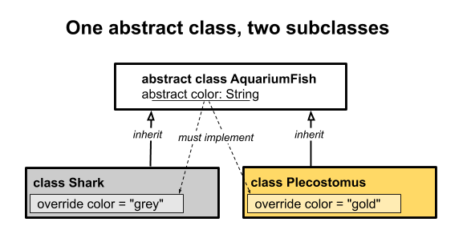
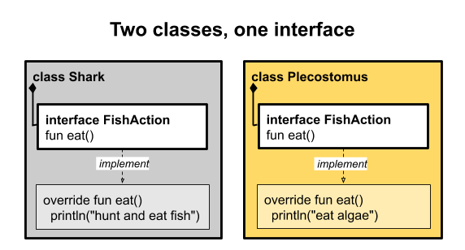

# 추상 클래스와 인터페이스의 비교
추상 클래스와 인터페이스는 그 타입 자체로 객체를 생성할 수 없습니다.

추상 클래스들은 생성자를 가질 수 있습니다.

인터페이스는 생성자나 상태를 저장할 수 없습니다.

## 추상 클래스 생성
```kotlin
abstract class AquariumFish {
    abstract val color: String
}
```

### 추상 클래스 구현
```kotlin
class Shark: AquariumFish() {
    override val color = "gray"
}

class Plecostomus: AquariumFish() {
    override val color = "gold"
}
```



## 인터페이스 생성
```kotlin
interface FishAction  {
    fun eat()
}
```

### 인터페이스 구현
```kotlin
class Shark: AquariumFish(), FishAction {
    override val color = "gray"
    override fun eat() {
        println("hunt and eat fish")
    }
}

class Plecostomus: AquariumFish(), FishAction {
    override val color = "gold"
    override fun eat() {
        println("eat algae")
    }
}
```



## 추상 클래스와 인터페이스 비교
- 인터페이스를 사용한 컴포지션은 추상 클래스의 상속보다 코드를 재사용하고 추론하기 쉽게 만드는 경향이 있음
- 추상 클래스는 단일 상속밖에 안되는 반면 인터페이스는 다중 상속이 가능함
- 컴포지션 방식은 캡슐화와 낮은 디커플링이 더 좋아짐

