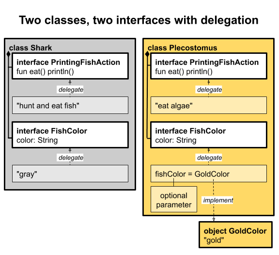

# 인터페이스 위임
인터페이스 위임은 클래스가 인터페이스 구현을 다른 객체에게 위임하는 것을 의미합니다.

이를 통해 코드 재사용성과 확장성을 향상시킬 수 있습니다.

## 인터페이스 위임 사용 방법
1. 인터페이스를 구현하는 클래스 정의
2. 클래스의 생성자에서 인터페시를 구현하는 다른 객체를 받도록 함

위와 같은 과정을 거쳐서 클래스는 구현한 인터페이스의 메서드를 호출할 때,

받은 객체에게 해당 메서드 호출을 위임하게 됩니다.

이를 톻애 인터페이스의 구현을 위임받은 객체는 해당 인터페이스의 메서드를

구현할 필요가 없으며, 위임하는 클래스는 해당 인터페이스의 메서드를 직접

구현하지 않아도 됩니다.

## 인터페이스 위임 장점
- 코드 중복 줄임
- 객체 간의 결합도 낮춤
- 유지 보수성 향상
- 인터페이스를 구현하는 객체를 교환할 수 있어 클래스의 동작을 쉽게 변경 가능함

```kotlin
interface FishColor {
    val color: String
}

object GoldColor : FishColor {
    override val color = "gold"
}

class PrintingFishAction(val food: String) : FishAction {
    override fun eat() {
        println(food)
    }
}

class Plecostomus (fishColor: FishColor = GoldColor):
    FishAction by PrintingFishAction("eat algae"),
    FishColor by fishColor

```

위 코드를 보면 Plecostomus 생성자의 FishColor 타입의 객체를 받게 되고

기본값은 GoldColor임을 알 수 있습니다. 그리고 by 키워드를 사용하여 오른쪽에 해당하는

객체에 기능을 위임하는 것을 알 수 있습니다.

그림을 표현하면 다음과 같습니다.

